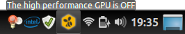
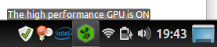
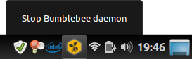
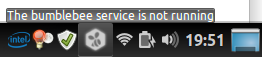
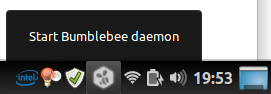

# Bumblebee Status Applet

Applet notifies using icon color about `bumblebeed` service status.

## Features

When `bumblebeed` is installed but no program is run using `optirun` then the status is displayed as follows:

If you run any programm using your high performance GPU, then the icon will change to:

Applet allows also to control start/stop of `bumblebeed` service. It uses `pkexec` or `gksu` to start/stop daemon.

When `bumblebeed` daemon is stopped, the icon is grayed out.

You can start `bumblebeed` daemon in similar way it was stopped.

## Installation

1. Download repository
1. Copy `bumblebee-status@trolleyyy` to `~/.local/share/cinnamon/applets`
1. Add applet to panel